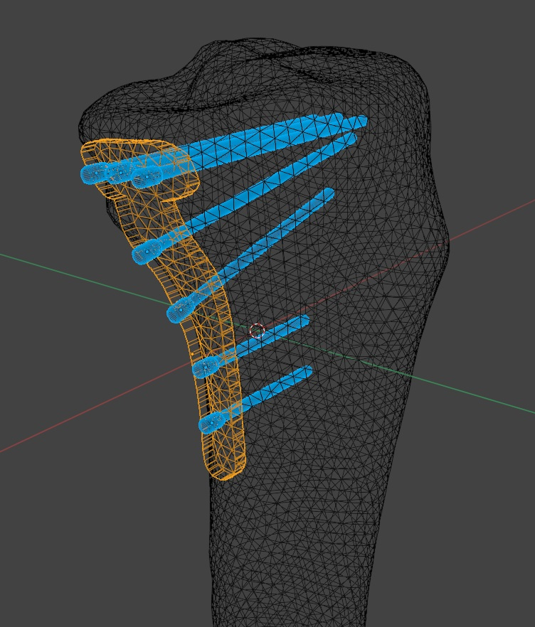
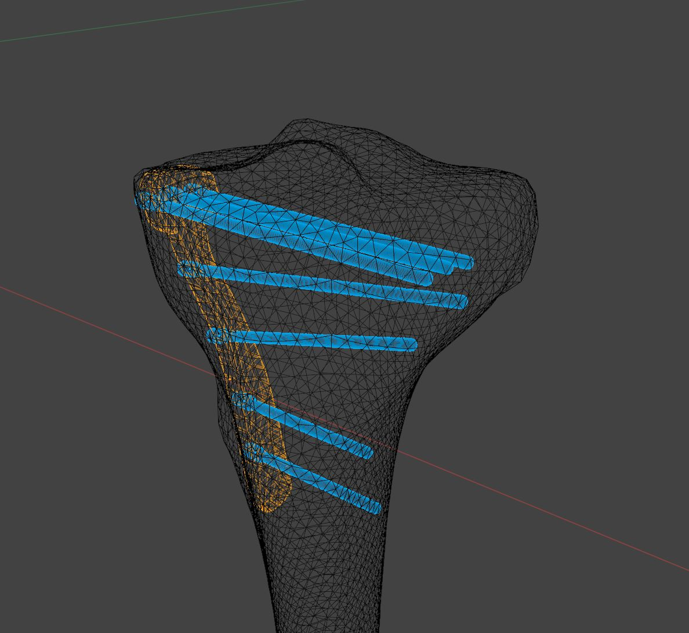
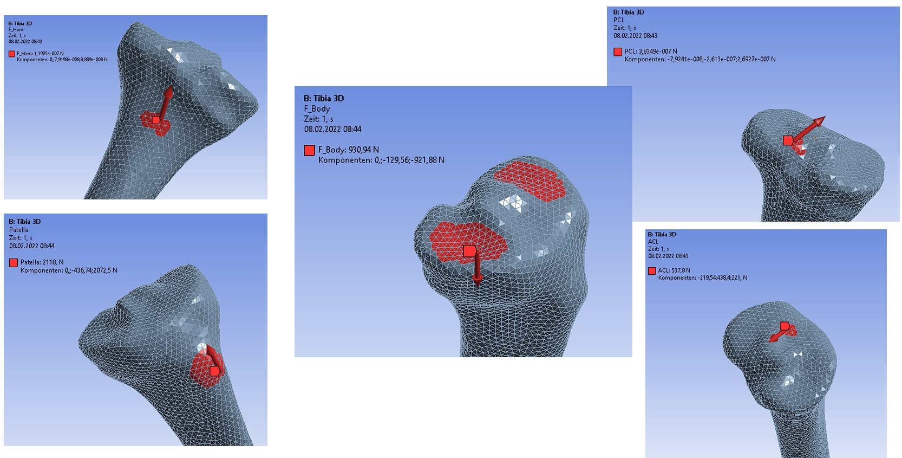
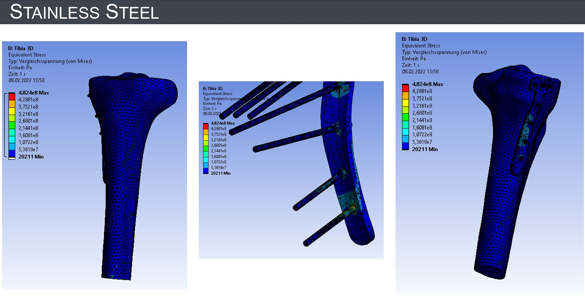
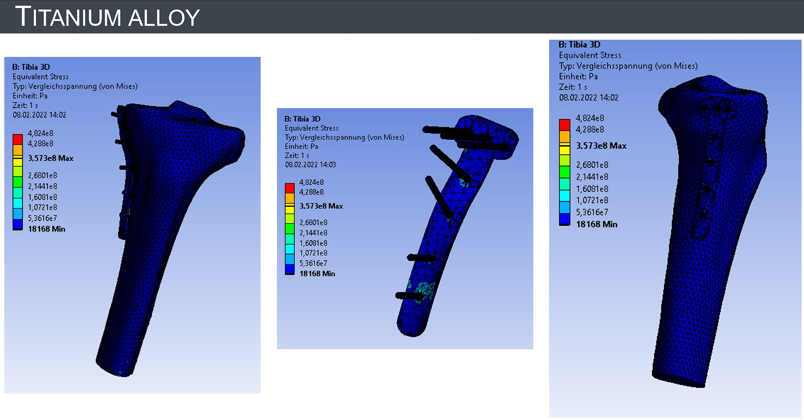

# **Project work: Finite element analysis of tibial plate osteosynthesis**
*This repository contains the Blender file for the tibia plate and images of the project*

Osteosynthesis is an operation in orthopedics where internal fixator are surgically implanted for the purpose of repairing a broken bone. The broken bone is fixated and can grow back together stabily in the correct position. Common materials for the internal fixator include stainless steel, titanium alloy, and cobalt-chrome alloy. Here we apply the finite element method (FEM) to compare von Mises stress on a tibial plate made of the first two mentioned materials.

0) Starting point: 3D mesh of the tibia

1) Creating a 3D model of a tibial plate in Blender

Medial (up) and frontolateral (below) view.

2) Implementation of forces in Ansys:

i) Definition of force application surfaces, and 

ii) lines of force action with x,y,z components

for
-  Body force acting from femur on tibia
- hamstrings
- patellar tendon
- anterior cruciate ligament (ACL) 
- posterior cruciate ligament (PCL)

3) FEM analysis for material comparison in [Ansys](https://www.ansys.com/): von Mises stress on tibial plate and screws made of either titanium alloy or stainless steel

